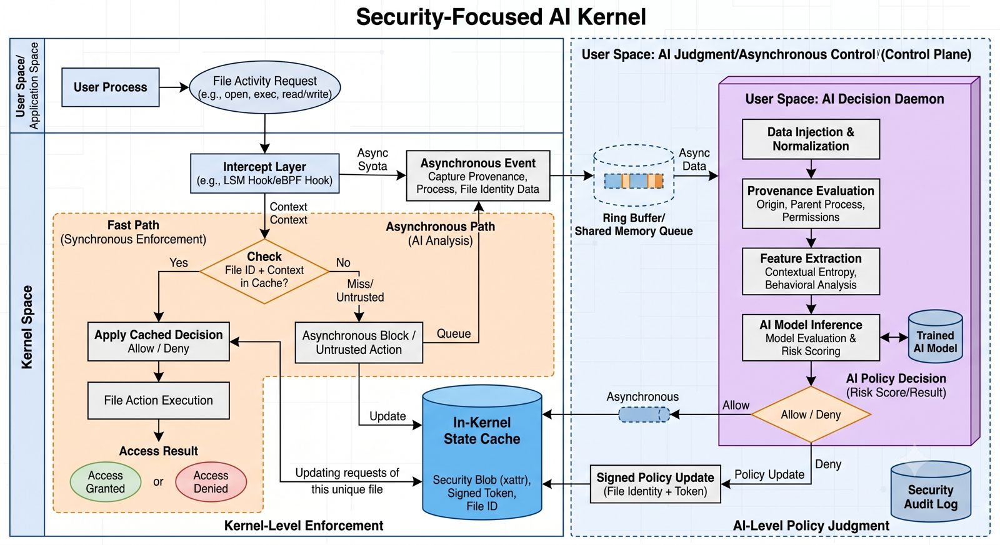

# Security-Focused AI Kernel

A research project exploring how an operating system can use AI for file
security while keeping the kernel fast.



## Idea

The main idea is to make the kernel responsible for enforcing security
decisions, while an AI security service helps decide whether a file
should be trusted.

Instead of repeatedly scanning the entire filesystem, the system gives
each file a persistent identity and keeps a security state for it.

For example:

``` text
File ID: 918273
Version: 42
State: Trusted
```

When a process tries to access a file, the kernel first checks its
current state.

If the file is already trusted and has not changed, the request can
continue normally without another expensive security check.

If the file is new, has changed, or has an unknown state, information
about the file is sent to the AI security service. The AI can consider
things such as:

-   Where the file came from
-   Which process created it
-   What the file is trying to do
-   What permissions it is requesting
-   Its previous security state
-   Relevant behaviour

The AI then sends a security decision back to the kernel.

The AI does not directly control the kernel. It only provides a
decision. The kernel is responsible for enforcing that decision.

## Kernel and AI

The kernel and AI have different responsibilities.

The kernel handles:

-   File identity
-   Security state
-   Access control
-   Process and file events
-   Allowing or denying operations
-   Applying security decisions

The AI handles:

-   Looking at the context of a file
-   Evaluating its origin and behaviour
-   Assigning a risk level
-   Providing a security decision

The basic flow is:

``` text
File Activity
      |
      v
    Kernel
      |
      +---- Known and trusted ----> Continue
      |
      +---- Unknown or changed ---> AI Analysis
                                      |
                                      v
                                Security Decision
                                      |
                                      v
                                    Kernel
                                      |
                              Allow / Restrict / Deny
```

## File Identity

A process ID cannot be used as a file identifier because PIDs belong to
processes and can change or be reused.

Instead, every file has its own identity.

The security information associated with a file can contain:

``` text
File ID
Version
Content information
Origin
Creator process
Security state
AI decision
```

For example:

``` text
File ID:       918273
Version:       42
Origin:        Browser download
State:         Trusted
AI Decision:   Safe
```

If a trusted file is modified, its previous security decision should no
longer automatically apply.

``` text
Trusted
   |
   | File changed
   v
Unknown
   |
   v
AI checks again
```

This allows the system to avoid checking unchanged files repeatedly
while still reacting when something important changes.

## Fast Path

The fast path is used when the kernel already has a valid decision for a
file.

``` text
Process
   |
   v
File Request
   |
   v
Kernel
   |
   v
Check File State
   |
   v
Known Decision
   |
   v
Allow / Deny
```

The goal is for this path to add very little overhead to normal file
operations.

## AI Path

The AI path is used when the kernel needs a new decision.

``` text
File Event
   |
   v
Kernel collects information
   |
   v
Security Service
   |
   v
AI Analysis
   |
   v
Security Decision
   |
   v
Kernel updates file state
```

The expensive AI analysis happens outside the normal kernel execution
path.

## Security States

A file can move between different states depending on what the system
currently knows about it.

``` text
UNKNOWN
   |
   v
AI Analysis
   |
   +------> TRUSTED
   |
   +------> RESTRICTED
                 |
                 v
             QUARANTINED
```

A trusted file can become unknown again if its contents or relevant
security information changes.

## Example

Suppose a browser downloads a new executable.

The kernel creates an identity for the file and marks it as unknown.

``` text
Browser
   |
   v
New File
   |
   v
Kernel
   |
   +--> File ID created
   +--> State = Unknown
   |
   v
AI Security Service
```

The AI receives the relevant information and returns a decision.

If the file is considered safe:

``` text
AI
 |
 v
Trusted
 |
 v
Kernel updates state
 |
 v
Normal access
```

If the file is considered suspicious:

``` text
AI
 |
 v
Restricted
 |
 v
Kernel applies restrictions
```

The kernel can apply different restrictions depending on the operation.
For example, a process could be allowed to read a file while being
prevented from executing it.

## Performance Goal

The main goal is to use AI for security without making normal system
operations slow.

We will compare the system with and without the security layer using
measurements such as:

-   File access time
-   Process startup time
-   System call overhead
-   CPU usage
-   Filesystem throughput
-   Time taken for AI decisions
-   Number of files requiring re-analysis

The expected behaviour is that files with an existing valid decision use
the fast kernel path, while files that need a new decision are sent for
further analysis.

## Goals

-   Build a small kernel environment for testing the security model.
-   Give files persistent identities.
-   Maintain file security states.
-   Keep normal file operations lightweight.
-   Send unknown or changed files to an AI security service.
-   Allow the AI to make security decisions using file context.
-   Let the kernel enforce those decisions.
-   Re-check files when their relevant state changes.
-   Support restricting or quarantining suspicious files.
-   Measure the performance and security of the system.
-   Test the system using both normal and malicious workloads.

## Project Status

This project is currently in the design and development stage.

The initial focus is on the kernel security layer, file identity,
communication between the kernel and the AI service, and the basic
allow/restrict/deny flow. Performance and security testing will be
carried out once the core system is working.

